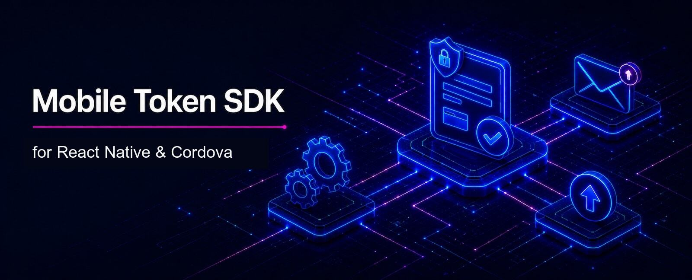

# Wultra Mobile Token JS SDK

__Wultra Mobile Token SDK__ provides APIs for secure operation approval, push notifications, inbox messages, and OIDC flows.

> [!NOTE]
> We currently support __REACT NATIVE__ and __APACHE CORDOVA__ development platforms.

<!-- begin remove -->

<!-- end -->

## Introduction
 
With Wultra Mobile Token (WMT) SDK, you can integrate an out-of-band operation approval into an existing mobile app, instead of using a standalone mobile token application. WMT is built on top of [PowerAuth Mobile JS SDK](https://github.com/wultra/react-native-powerauth-mobile-sdk). Individual endpoints are described in the [Mobile Token API](https://developers.wultra.com/components/enrollment-server/develop/documentation/Mobile-Token-API).

To understand the Wultra Mobile Token SDK purpose on a business level better, you can visit our own [Mobile Token application](https://www.wultra.com/mobile-token). We use (native) Wultra Mobile Token SDK in our mobile token application as well.

**With this SDK, you can:**

- [Retrieve, approve, or reject operations pending approval for a given user.](docs/Using-Operations.md)
- [Claim anonymous operations.](docs/Using-Operations.md#claim-the-operation)
- [Retrieve operation history.](docs/Using-Operations.md#operation-history)
- [Do offline authorization.](docs/Using-Operations.md#off-line-authorization)
- [Register an existing PowerAuth activation to receive push notifications.](docs/Using-Push.md)
- [Manage users' inbox messages.](docs/Using-Inbox.md)
- [Handle OpenID Connect (OIDC) authentication flows.](docs/Using-OIDC.md)
- [Explore more.](docs)

> [!NOTE]
> - This library does not contain any UI.
> - We also provide an [Android](https://github.com/wultra/mtoken-sdk-android), [iOS](https://github.com/wultra/mtoken-sdk-ios), and [Flutter](https://github.com/wultra/mtoken-sdk-flutter) versions of this library.

## Documentation

The documentation is available at the [Wultra Developer Portal](https://developers.wultra.com/components/mtoken-sdk-js/) or inside the [docs](docs) folder.

## License

All sources are licensed using the Apache 2.0 license. You can use them with no restrictions. If you are using this library, please let us know. We will be happy to share and promote your project.

## Contact

If you need any assistance, do not hesitate to drop us a line at [hello@wultra.com](mailto:hello@wultra.com) or our official [wultra.com/discord](wultra.com/discord) channel.

### Security Disclosure

If you believe you have identified a security vulnerability with Wultra Mobile Token SDK, you should report it as soon as possible via email to [support@wultra.com](mailto:support@wultra.com). Please do not post it to a public issue tracker.
